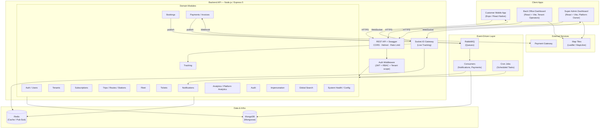
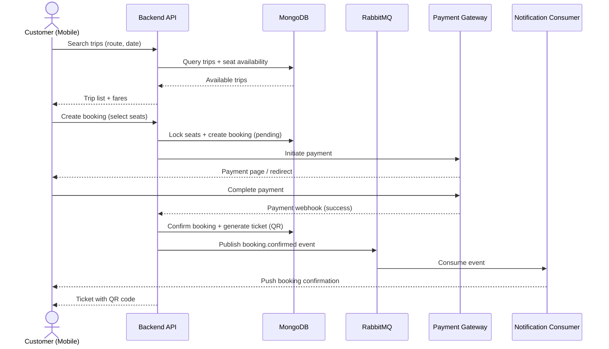
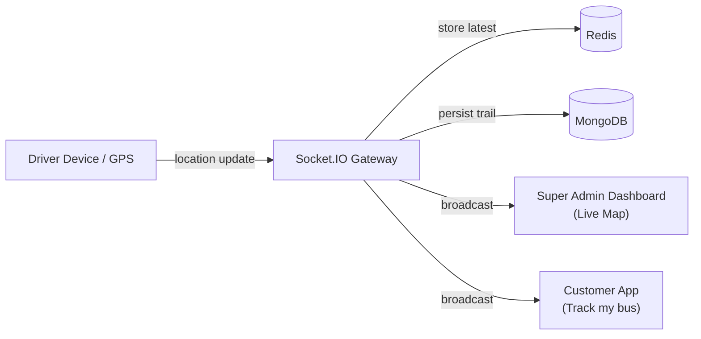
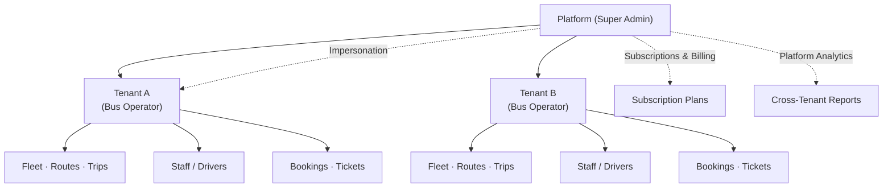

# Mousa DAO — Transport Management Platform

Multi-tenant বাস/ট্রান্সপোর্ট বুকিং SaaS প্ল্যাটফর্ম। নিচে সিস্টেমের আর্কিটেকচার ও মূল ফ্লো মারমেইড ডায়াগ্রামে দেওয়া হলো।

---

## ১. সিস্টেম আর্কিটেকচার (High-Level)

---

## ২. বুকিং ও পেমেন্ট ফ্লো (Sequence)

---

## ৩. লাইভ ট্র্যাকিং ফ্লো (Real-Time)

---

## ৪. মাল্টি-টেন্যান্ট মডেল

