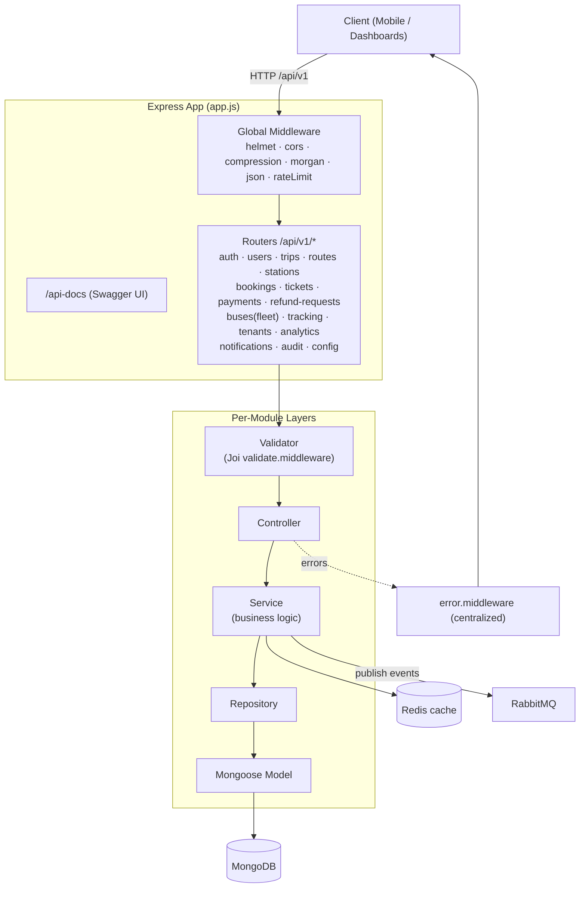
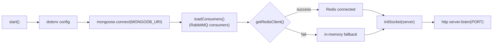
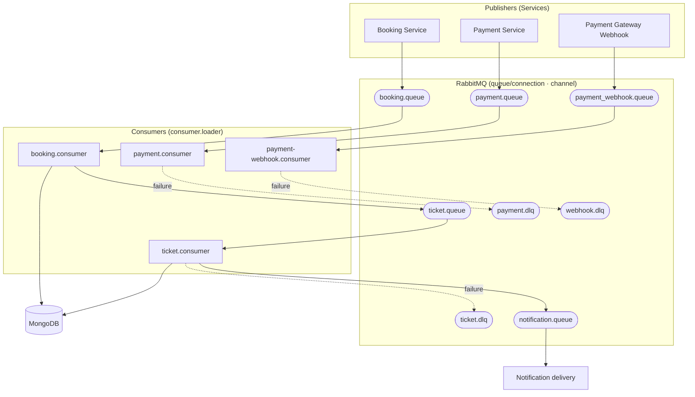
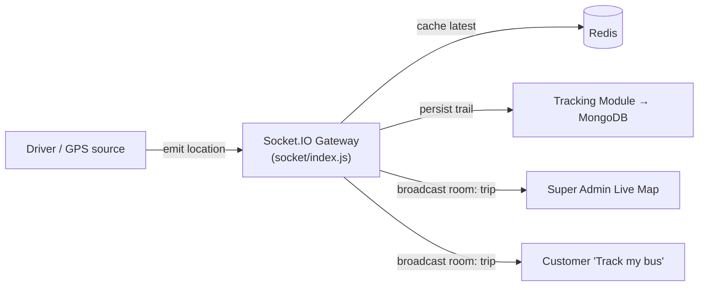
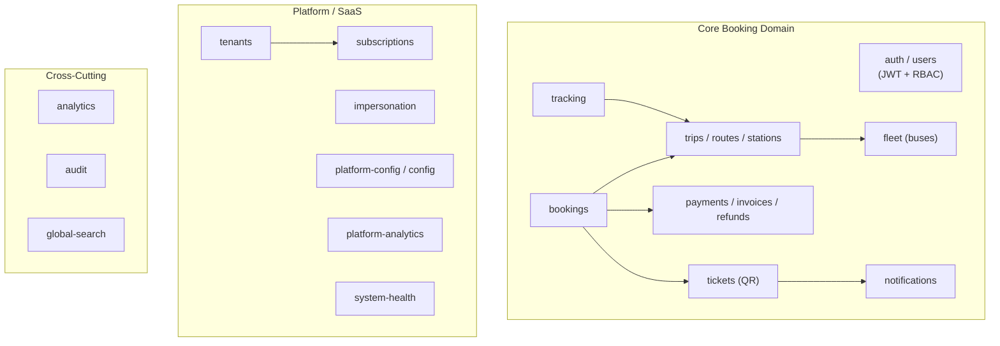

# Mousa DAO — Backend Architecture

Node.js / Express 5 ভিত্তিক transport management API। MongoDB (Mongoose), Redis (ioredis), RabbitMQ (amqplib), Socket.IO ও JWT ব্যবহার করে। নিচে ব্যাকএন্ডের বিস্তারিত মারমেইড ডায়াগ্রাম দেওয়া হলো।

---

## ১. লেয়ারড আর্কিটেকচার ও রিকোয়েস্ট লাইফসাইকেল

---

## ২. অ্যাপ্লিকেশন বুটস্ট্র্যাপ (server.js)

---

## ৩. ইভেন্ট-ড্রিভেন / কিউ আর্কিটেকচার (RabbitMQ)

---

## ৪. রিয়েল-টাইম ট্র্যাকিং (Socket.IO + Redis)

---

## ৫. মূল ডোমেইন মডিউলসমূহ

