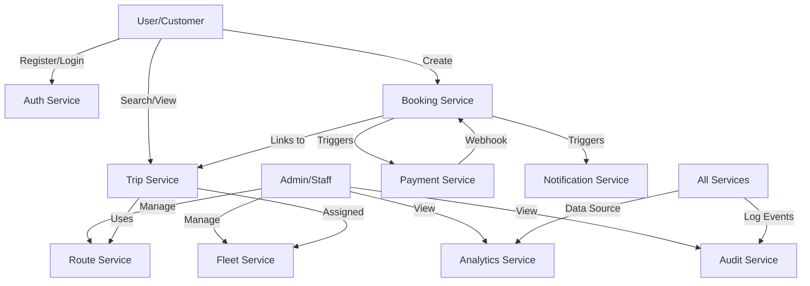

# Mousa DAO Transport Management System

## Overview
Mousa DAO is a comprehensive transport management system designed to handle bus bookings, trip scheduling, fleet management, and automated payments. The system is built with a modular architecture to ensure scalability and maintainability.

## Core Modules

### 1. Authentication & User Management (`src/modules/auth`, `src/modules/users`)
- Handles user registration, login, and profile management.
- Implements Role-Based Access Control (RBAC) with roles like `admin`, `staff`, `driver`, and `customer`.
- Uses JWT for secure session management.

### 2. Trips & Routes (`src/modules/trips`)
- **Routes**: Defines paths between stations, including base fares and distances.
- **Trips**: Scheduled instances of routes with specific buses, departure times, and pricing.

### 3. Fleet Management (`src/modules/fleet`)
- Manages bus inventory, maintenance logs, and driver assignments.
- Tracks bus status (active, maintenance, inactive).

### 4. Bookings & Tickets (`src/modules/bookings`, `src/modules/tickets`)
- Allows customers to book seats on available trips.
- Manages ticket generation and seat availability.

### 5. Payments (`src/modules/payments`)
- Integrates with payment gateways to handle transactions.
- Uses webhooks to process payment confirmations asynchronously.

### 6. Notifications (`src/modules/notifications`)
- Sends automated notifications for booking confirmations, trip updates, and payment status.

### 7. Analytics (`src/modules/analytics`)
- Provides dashboard overviews and detailed reports on revenue, bookings, and user activity.

### 8. Audit & Logging (`src/modules/audit`)
- Tracks all critical actions within the system for security and troubleshooting.

## System Architecture

## Getting Started

### Prerequisites
- Node.js (v18+)
- MongoDB
- RabbitMQ (for event-driven consumers)

### Installation
1. Clone the repository.
2. Run `npm install`.
3. Configure `.env` based on `.env.example`.
4. Run `npm start` to start the server.

### API Documentation
The API documentation is available via Swagger at:
`http://localhost:5000/api-docs`

## Queue System
The project uses a queue-based architecture for background tasks like sending notifications and processing payments. Consumers are located in `src/consumers/`.
